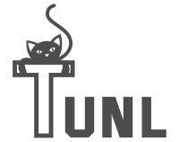

<p align="center"></p>

# tunl
a serverless v2ray tunnel ([docs](https://github.com/bepass-org/tunl/wiki))

## Deploy

### Easy Deploy (recommended)
click on the button below:

[](https://deploy.workers.cloudflare.com/?url=https://github.com/bepass-org/tunl)

and visit https://{YOUR-WORKERS-SUBDOMAIN}.workers.dev/link to get the config links.

### Manually
1. [Create an API token](https://developers.cloudflare.com/fundamentals/api/get-started/create-token/) from the cloudflare dashboard.
2. Create a `.env` file based on `.env.example` and fill the values based on your tokens

| Variable            | Description                                      |
|---------------------|--------------------------------------------------|
| CLOUDFLARE_API_TOKEN | The API key retrieved from Cloudflare dashboard |

3. Deploy
```sh
$ make deploy
```

4. Modify the [xray config](./config/xray.json) and run:
```sh
$ xray -c ./config/xray.json
```

## Contributing
Contributions are very welcome. Before contributing, make sure to look at the
contribution documentation in [HACKING.md](./HACKING.md).
